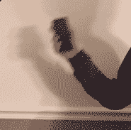
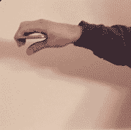
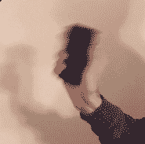
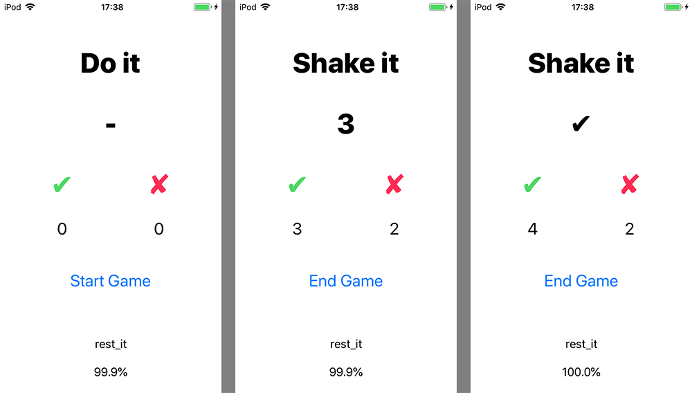

# GestureClassifier

识别人体姿势，包括 chop, drive, shake, rest(静止状态)：

<table>
  <tr>
    <td>

</td>
    <td>

</td>
    <td>

</td>
  </tr>
  <tr>
    <td>
chop
</td>
    <td>
drive
</td>
    <td>
shake
</td>
  </tr>
</table>

在 APP 的最下方显示当前预测的姿势及其 confidence.

按下“Start Game”按钮开始游戏，在每个回合，用户需要在 3 秒内完成随机指定的动作，成功完成则计入“✔︎”，超时则计入“✘”。按下“End Game” 按钮来结束游戏。

**屏幕截图（iPod touch 6）：**

